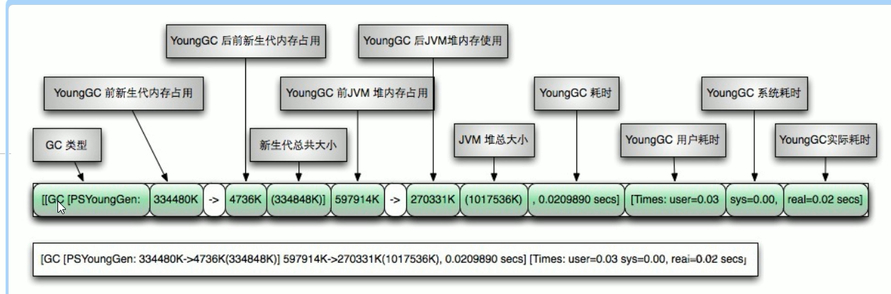

* [1\. JVM内存结构](#1-jvm%E5%86%85%E5%AD%98%E7%BB%93%E6%9E%84)
* [2\. GC Roots](#2-gc-roots)
  * [2\.1 如果判断一个对象可以被回收？](#21-%E5%A6%82%E6%9E%9C%E5%88%A4%E6%96%AD%E4%B8%80%E4%B8%AA%E5%AF%B9%E8%B1%A1%E5%8F%AF%E4%BB%A5%E8%A2%AB%E5%9B%9E%E6%94%B6)
  * [2\.2 哪些对象可以作为GC Roots？](#22-%E5%93%AA%E4%BA%9B%E5%AF%B9%E8%B1%A1%E5%8F%AF%E4%BB%A5%E4%BD%9C%E4%B8%BAgc-roots)
* [3\. 盘点查看JVM系统默认值](#3-%E7%9B%98%E7%82%B9%E6%9F%A5%E7%9C%8Bjvm%E7%B3%BB%E7%BB%9F%E9%BB%98%E8%AE%A4%E5%80%BC)
  * [3\.1 JVM的参数类型](#31-jvm%E7%9A%84%E5%8F%82%E6%95%B0%E7%B1%BB%E5%9E%8B)
    * [3\.1\.1 标配参数](#311-%E6%A0%87%E9%85%8D%E5%8F%82%E6%95%B0)
    * [3\.1\.2 X参数(了解)](#312-x%E5%8F%82%E6%95%B0%E4%BA%86%E8%A7%A3)
    * [3\.1\.3 XX参数](#313-xx%E5%8F%82%E6%95%B0)
      * [3\.1\.3\.1 布尔类型](#3131-%E5%B8%83%E5%B0%94%E7%B1%BB%E5%9E%8B)
      * [3\.1\.3\.1 KV类型](#3131-kv%E7%B1%BB%E5%9E%8B)
  * [3\.2 查看JVM参数](#32-%E6%9F%A5%E7%9C%8Bjvm%E5%8F%82%E6%95%B0)
    * [3\.2\.1 查看当前运行程序某个参数的配置](#321-%E6%9F%A5%E7%9C%8B%E5%BD%93%E5%89%8D%E8%BF%90%E8%A1%8C%E7%A8%8B%E5%BA%8F%E6%9F%90%E4%B8%AA%E5%8F%82%E6%95%B0%E7%9A%84%E9%85%8D%E7%BD%AE)
    * [3\.2\.2 查看当前运行程序所有参数的配置](#322-%E6%9F%A5%E7%9C%8B%E5%BD%93%E5%89%8D%E8%BF%90%E8%A1%8C%E7%A8%8B%E5%BA%8F%E6%89%80%E6%9C%89%E5%8F%82%E6%95%B0%E7%9A%84%E9%85%8D%E7%BD%AE)
    * [3\.2\.3 查看JVM默认值](#323-%E6%9F%A5%E7%9C%8Bjvm%E9%BB%98%E8%AE%A4%E5%80%BC)
* [4\. JVM 常用参数](#4-jvm-%E5%B8%B8%E7%94%A8%E5%8F%82%E6%95%B0)
  * [4\.1 \-Xmx/\-Xms](#41--xmx-xms)
  * [4\.2 \-Xss](#42--xss)
  * [4\.3 \-Xmn](#43--xmn)
  * [4\.4 \-XX:MetaspaceSize](#44--xxmetaspacesize)
  * [4\.5 \-XX:\+PrintGCDetails](#45--xxprintgcdetails)
  * [4\.6 \-XX:SurvivorRatio](#46--xxsurvivorratio)
  * [4\.7 \-XX:NewRatio](#47--xxnewratio)
  * [4\.8\. \-XX:MaxTenuringThreshold](#48--xxmaxtenuringthreshold)
* [5\. 强引用、软引用、弱引用、虚引用分别是什么?](#5-%E5%BC%BA%E5%BC%95%E7%94%A8%E8%BD%AF%E5%BC%95%E7%94%A8%E5%BC%B1%E5%BC%95%E7%94%A8%E8%99%9A%E5%BC%95%E7%94%A8%E5%88%86%E5%88%AB%E6%98%AF%E4%BB%80%E4%B9%88)
  * [5\.1 强引用](#51-%E5%BC%BA%E5%BC%95%E7%94%A8)
  * [5\.2 软引用](#52-%E8%BD%AF%E5%BC%95%E7%94%A8)
  * [5\.3 弱引用](#53-%E5%BC%B1%E5%BC%95%E7%94%A8)
    * [5\.3\.1 WeakHashMap](#531-weakhashmap)
    * [5\.3\.2 引用队列](#532-%E5%BC%95%E7%94%A8%E9%98%9F%E5%88%97)
  * [5\.4 虚引用](#54-%E8%99%9A%E5%BC%95%E7%94%A8)
  * [5\.5 小总结](#55-%E5%B0%8F%E6%80%BB%E7%BB%93)
* [6\. 请谈谈你对OOM的认识](#6-%E8%AF%B7%E8%B0%88%E8%B0%88%E4%BD%A0%E5%AF%B9oom%E7%9A%84%E8%AE%A4%E8%AF%86)
  * [6\.1 java\.lang\.StackOverflowError](#61-javalangstackoverflowerror)
  * [6\.2 Java\.lang\.OutOfMemoryError:Java heap space](#62-javalangoutofmemoryerrorjava-heap-space)
  * [6\.3 java\.lang\.OutOfMemoryError: GC overhead limit exceeded](#63-javalangoutofmemoryerror-gc-overhead-limit-exceeded)
  * [6\.4 Java\.lang\.OutOfMemeoryError:GC overhead limit exceeded](#64-javalangoutofmemeoryerrorgc-overhead-limit-exceeded)
  * [6\.5 Java\.lang\.OutOfMemeoryError:Direct buffer memory](#65-javalangoutofmemeoryerrordirect-buffer-memory)
  * [6\.6 java\.lang\.OutOfMemoryError: unable to create new native thread](#66-javalangoutofmemoryerror-unable-to-create-new-native-thread)
  * [6\.7 OOM—Metaspace](#67-oommetaspace)
* [7\. GC垃圾回收算法和垃圾收集器](#7-gc%E5%9E%83%E5%9C%BE%E5%9B%9E%E6%94%B6%E7%AE%97%E6%B3%95%E5%92%8C%E5%9E%83%E5%9C%BE%E6%94%B6%E9%9B%86%E5%99%A8)
  * [7\.1 GC垃圾回收算法](#71-gc%E5%9E%83%E5%9C%BE%E5%9B%9E%E6%94%B6%E7%AE%97%E6%B3%95)
  * [7\.2 垃圾收集器](#72-%E5%9E%83%E5%9C%BE%E6%94%B6%E9%9B%86%E5%99%A8)
    * [7\.2\.1 串行收集器Serial](#721-%E4%B8%B2%E8%A1%8C%E6%94%B6%E9%9B%86%E5%99%A8serial)
    * [7\.2\.2 并行收集器Parrallel](#722-%E5%B9%B6%E8%A1%8C%E6%94%B6%E9%9B%86%E5%99%A8parrallel)
    * [7\.2\.3 并发收集器CMS](#723-%E5%B9%B6%E5%8F%91%E6%94%B6%E9%9B%86%E5%99%A8cms)
    * [7\.2\.4 G1收集器](#724-g1%E6%94%B6%E9%9B%86%E5%99%A8)
* [8\. 怎么查看服务器默认的垃圾收集器是哪个?如何配置？理解?](#8-%E6%80%8E%E4%B9%88%E6%9F%A5%E7%9C%8B%E6%9C%8D%E5%8A%A1%E5%99%A8%E9%BB%98%E8%AE%A4%E7%9A%84%E5%9E%83%E5%9C%BE%E6%94%B6%E9%9B%86%E5%99%A8%E6%98%AF%E5%93%AA%E4%B8%AA%E5%A6%82%E4%BD%95%E9%85%8D%E7%BD%AE%E7%90%86%E8%A7%A3)
  * [8\.1 默认垃圾收集器](#81-%E9%BB%98%E8%AE%A4%E5%9E%83%E5%9C%BE%E6%94%B6%E9%9B%86%E5%99%A8)
  * [8\.\.2  查看默认垃圾修改器](#82--%E6%9F%A5%E7%9C%8B%E9%BB%98%E8%AE%A4%E5%9E%83%E5%9C%BE%E4%BF%AE%E6%94%B9%E5%99%A8)
  * [8\.3 七大垃圾收集器](#83-%E4%B8%83%E5%A4%A7%E5%9E%83%E5%9C%BE%E6%94%B6%E9%9B%86%E5%99%A8)
    * [8\.3\.1 Serial收集器](#831-serial%E6%94%B6%E9%9B%86%E5%99%A8)
    * [8\.3\.2 ParNew收集器](#832-parnew%E6%94%B6%E9%9B%86%E5%99%A8)
    * [8\.3\.3 Parallel Scavenge收集器](#833-parallel-scavenge%E6%94%B6%E9%9B%86%E5%99%A8)
    * [8\.3\.4 ParallelOld收集器](#834-parallelold%E6%94%B6%E9%9B%86%E5%99%A8)
    * [8\.3\.5 CMS收集器](#835-cms%E6%94%B6%E9%9B%86%E5%99%A8)
    * [8\.3\.6 SerialOld收集器](#836-serialold%E6%94%B6%E9%9B%86%E5%99%A8)
    * [8\.3\.7 G1收集器](#837-g1%E6%94%B6%E9%9B%86%E5%99%A8)
    * [8\.3\.8 小总结](#838-%E5%B0%8F%E6%80%BB%E7%BB%93)
* [9\. 生产环境服务器变慢，诊断思路和性能评估谈谈?](#9-%E7%94%9F%E4%BA%A7%E7%8E%AF%E5%A2%83%E6%9C%8D%E5%8A%A1%E5%99%A8%E5%8F%98%E6%85%A2%E8%AF%8A%E6%96%AD%E6%80%9D%E8%B7%AF%E5%92%8C%E6%80%A7%E8%83%BD%E8%AF%84%E4%BC%B0%E8%B0%88%E8%B0%88)
  * [9\.1 top](#91-top)
  * [9\.2 vmstat](#92-vmstat)
  * [9\.3 pidstat](#93-pidstat)
  * [9\.4 free](#94-free)
  * [9\.5 df](#95-df)
  * [9\.6 iostat](#96-iostat)
  * [9\.7 ifstat](#97-ifstat)
* [10\. 假如生产环境出现CPU占用过高，请谈谈你的分析思路和定位](#10-%E5%81%87%E5%A6%82%E7%94%9F%E4%BA%A7%E7%8E%AF%E5%A2%83%E5%87%BA%E7%8E%B0cpu%E5%8D%A0%E7%94%A8%E8%BF%87%E9%AB%98%E8%AF%B7%E8%B0%88%E8%B0%88%E4%BD%A0%E7%9A%84%E5%88%86%E6%9E%90%E6%80%9D%E8%B7%AF%E5%92%8C%E5%AE%9A%E4%BD%8D)
* [11\. JVM性能调优和监控工具](#11-jvm%E6%80%A7%E8%83%BD%E8%B0%83%E4%BC%98%E5%92%8C%E7%9B%91%E6%8E%A7%E5%B7%A5%E5%85%B7)
  * [11\.1 jps](#111-jps)
  * [11\.2 jstack](#112-jstack)
  * [11\.3 jinfo/jstat](#113-jinfojstat)
  * [11\.4 jmap](#114-jmap)

## 1. JVM内存结构


基本结构与之前类似，只是Java8取消了之前的“永久代”，取而代之的是“元空间”——**Metaspace**，两者本质是一样的。“永久代”使用的是JVM的堆内存，而“元空间”是直接使用的本机物理内存。

## 2. GC Roots

### 2.1 如果判断一个对象可以被回收？

- 引用计数算法: 维护一个计数器，如果有对该对象的引用，计数器+1，反之-1。无法解决循环引用的问题。

- 可达性分析算法: 所谓的“GC roots”或者说tracing GC 的“根集合”就是一组必须活跃的引用。

  > 这个算法的基本思路就是通过一系列的称为“GC Roots”的对象作为起始点，从这些节点开始向下搜索，搜索所走过的路径称为引用链，当一个对象到GC Roots没有任何引用链相连时，则证明此对象是不可用的。

  

### 2.2 哪些对象可以作为GC Roots？

- 虚拟机栈（栈帧中的局部变量）中引用的对象。
- 方法区中类静态属性引用的对象。

- 方法区中常量引用的对象。

- 本地方法栈（native）中引用的对象。

## 3. 盘点查看JVM系统默认值

### 3.1 JVM的参数类型

#### 3.1.1 标配参数

比如`-version`、`-help`、`-showversion`等，几乎不会改变。

#### 3.1.2 X参数(了解)

比如`-Xint`解释执行模式；`-Xcomp`第一次使用就编译本地代码；`-Xmixed`，开启混合模式（默认）。

#### 3.1.3 XX参数

**重要，用于JVM调优。**

##### 3.1.3.1 布尔类型

**公式**：`-XX:+某个属性`、`-XX:-某个属性`，开启或关闭某个功能。比如`-XX:+PrintGCDetails`，开启GC详细信息。

##### 3.1.3.1 KV类型

**公式**：`-XX:属性key=值value`。比如`-XX:Metaspace=128m`、`-XX:MaxTenuringThreshold=15`。

> `-Xms`和`-Xmx`十分常见，用于设置**初始堆大小**和**最大堆大小**。第一眼看上去，既不像X参数，也不像XX参数。实际上`-Xms`等价于`-XX:InitialHeapSize`，`-Xmx`等价于`-XX:MaxHeapSize`。所以`-Xms`和`-Xmx`属于XX参数。

### 3.2 查看JVM参数

#### 3.2.1 查看当前运行程序某个参数的配置

使用`jps -l`配合`jinfo -flag JVM参数 pid` 。先用`jsp -l`查看java进程，选择某个进程号。

```shell
G:\IDEA-workspace\JUC&JVM&GC>jps -l
11764 org.jetbrains.kotlin.daemon.KotlinCompileDaemon
13908 sun.tools.jps.Jps
1508 org.jetbrains.jps.cmdline.Launcher
2724
5388 jvm.HelloGC
```

`jinfo -flag PrintGCDetails 5388`可以查看5388 Java进程的`PrintGCDetails`参数信息。

```shell
G:\IDEA-workspace\JUC&JVM&GC>jinfo -flag PrintGCDetails 5388
-XX:-PrintGCDetails
```

#### 3.2.2 查看当前运行程序所有参数的配置

使用`jps -l`配合`jinfo -flags pid`可以查看所有参数。

#### 3.2.3 查看JVM默认值

**查看初始默认值公式**: `java -XX:+PrintFlagsInitial -version` 或者 `java -XX:+PrintFlagsInitial`

```shell
G:\IDEA-workspace\JUC&JVM&GC>java -XX:+PrintFlagsInitial
[Global flags]
    uintx AdaptiveSizeDecrementScaleFactor          = 4                                   {product}
    uintx AdaptiveSizeMajorGCDecayTimeScale         = 10                                  {product}
    uintx AdaptiveSizePausePolicy                   = 0                                   {product}
......
     bool ZeroTLAB                                  = false                               {product}
     intx hashCode                                  = 5                                   {product}
```

**主要查看修改更新公式**: `java -XX:+PrintFlagsFinal ` 或者 `java -XX:+PrintFlagsFinal -version`

```shell
G:\IDEA-workspace\JUC&JVM&GC>java -XX:+PrintFlagsFinal -version
[Global flags]
    uintx AdaptiveSizeDecrementScaleFactor          = 4                                   {product}
    uintx AdaptiveSizeMajorGCDecayTimeScale         = 10                                  {product}
......
 bool PrintFlagsFinal                          := true                                {product}
......
```

> 注意: 带冒号的是JVM或者是人为修改过的更新值

**查看常见参数**: 如果不想查看所有参数，可以用`java -XX:+PrintCommandLineFlags -version`查看常用参数。

```shell
G:\IDEA-workspace\JUC&JVM&GC>java -XX:+PrintCommandLineFlags -version
-XX:InitialHeapSize=266553600 -XX:MaxHeapSize=4264857600 -XX:+PrintCommandLineFlags -XX:+UseCompressedClassPointers -XX:+UseCompressedOops -XX:-Use
LargePagesIndividualAllocation -XX:+UseParallelGC
java version "1.8.0_172"
Java(TM) SE Runtime Environment (build 1.8.0_172-b11)
Java HotSpot(TM) 64-Bit Server VM (build 25.172-b11, mixed mode)
```

## 4. JVM 常用参数

### 4.1 -Xmx/-Xms

-Xmx：最大分配内存，默认为物理内存1/4，等价于`-XX:MaxHeapSize`

-Xms：初始大小内存，默认为物理内存1/64，等价于`-XX:InitialHeapSize`

### 4.2 -Xss

设置单个线程栈的大小，一般默认为512K~1024K，等价于`-XX:ThreadStackSize`

> 根据操作系统的不同，有不同的值。比如64位的Linux系统是1024K，而Windows系统依赖于虚拟内存。

### 4.3 -Xmn

设置年轻代大小，一般不调

### 4.4 -XX:MetaspaceSize

设置元空间大小

### 4.5 -XX:+PrintGCDetails

输出`GC`收集信息，包含`GC`和`Full GC`信息。




### 4.6 -XX:SurvivorRatio

新生代中，`Eden`区和两个`Survivor`区的比例，默认是`8:1:1`。通过`-XX:SurvivorRatio=4`改成`4:1:1`

### 4.7 -XX:NewRatio

老生代和新年代的比列，默认是2，即老年代占2，新生代占1。如果改成`-XX:NewRatio=4`，则老年代占4，新生代占1。

 ### 4.8. -XX:MaxTenuringThreshold

新生代设置进入老年代的时间，默认是新生代逃过15次GC后，进入老年代。如果改成0，那么对象不会在新生代分配，直接进入老年代。

## 5. 强引用、软引用、弱引用、虚引用分别是什么?

### 5.1 强引用

使用`new`方法创造出来的对象，默认都是强引用。GC的时候，就算**内存不够**，抛出`OutOfMemoryError`也不会回收对象，**死了也不回收**。

```java
Object o1=new Object();
Object o2=new Object();
o1=null;
System.gc();
System.out.println(o2); //java.lang.Object@4554617c
```

### 5.2 软引用

需要用`Object.Reference.SoftReference`来显示创建。**如果内存够**，GC的时候**不回收**。**内存不够**，**则回收**。常用于内存敏感的应用，比如高速缓存。

```java
    /**
     * 内存够用的情况下保留
     */
    private static void softRef_Memory_Enough() {
        Object o1 = new Object();
        SoftReference<Object> softReference = new SoftReference<>(o1);

        o1 = null;
        System.gc();

        System.out.println(o1);
        System.out.println(softReference.get());
    } 
	// ********************************************************************** //
	运行结果: 
	null
	java.lang.Object@4554617c
```

```java
	/**
     *  故意产生大对象配置小内存,产生OOM,看软应用回收情况
     *  配置参数: -Xms5m -Xmx5m -XX:+PrintGCDetails
     */
    private static void softRef_Memory_NotEnough() {
        Object o1 = new Object();
        SoftReference<Object> softReference = new SoftReference<>(o1);
        System.out.println(o1);
        System.out.println(softReference.get());
        o1 = null;
        try {
            byte[] bytes = new byte[30*1024*1024];
        }catch (Exception exception){
            exception.printStackTrace();
        }finally {
            System.out.println(o1);
            System.out.println(softReference.get());
        }
    }
    // ********************************************************************** //
    运行结果: 
    [GC (Allocation Failure) [PSYoungGen: 1024K->504K(1536K)] 1024K->568K(5632K), 			0.0009868 secs] [Times: user=0.00 sys=0.00, real=0.00 secs] 
    java.lang.Object@4554617c
    java.lang.Object@4554617c
    ......
    null
    null
    ......
```

### 5.3 弱引用

需要用`Object.Reference.WeakReference`来显示创建。**无论内存够不够，GC的时候都回收**，也可以用在高速缓存上。

```java
public class WeakReferenceDemo {

    public static void main(String[] args) {
        Object o = new Object();
        WeakReference<Object> weakReference = new WeakReference<>(o);
        System.out.println(o);
        System.out.println(weakReference.get());
        o = null;
        System.gc();
        System.out.println("*************************");
        System.out.println(o);
        System.out.println(weakReference.get());
    }
}
// ********************************************************************** //
运行结果: 
java.lang.Object@4554617c
java.lang.Object@4554617c
*************************
null
null
```

#### 5.3.1 WeakHashMap

传统的`HashMap`就算`key==null`了，`GC`也不会回收键值对。但是如果是`WeakHashMap`，一旦发生`GC`，且`key==null`时，会回收这个键值对。

```java
	private static void myHashMap() {
        HashMap<Integer, String> map = new HashMap<>();
        Integer key = new Integer(1);
        String value = "HashMap";
        map.put(key,value);
        key = null;
        System.out.println(map);
        System.gc();
        System.out.println(map + "---->" + map.size());
    }
    // ********************************************************************** //
    运行结果: 
	{1=HashMap}
	{1=HashMap}---->1
```

```java
	private static void myWeakHashMap() {
        WeakHashMap<Integer, String> map = new WeakHashMap<>();
        Integer key = new Integer(2);
        String value = "WeakHashMap";
        map.put(key,value);
        key = null;
        System.out.println(map);
        System.gc();
        System.out.println(map + "---->" + map.size());
    }
	// ********************************************************************** //
    运行结果:
	{2=WeakHashMap}
	{}---->0
```

#### 5.3.2 引用队列

弱引用、虚引用被回收后，会被放到引用队列里面，通过`poll`方法可以得到。关于引用队列和弱、虚引用的配合使用

### 5.4 虚引用

软应用和弱引用可以通过`get()`方法获得对象，但是虚引用的`get()`方法总是返回null。虚引形同虚设，在任何时候都可能被GC，不能单独使用，必须配合**引用队列（ReferenceQueue）来使用。设置虚引用的唯一目的**，就是在这个对象被回收时，收到一个**通知**以便进行后续操作，有点像`Spring`的后置通知。

```java
public class PhantomReferenceDemo {
    public static void main(String[] args) {
        Object o = new Object();
        ReferenceQueue referenceQueue = new ReferenceQueue();
        PhantomReference<Object> phantomReference = new PhantomReference<>(o,referenceQueue);

        System.out.println(o);
        System.out.println(phantomReference.get());
        System.out.println(referenceQueue.poll());

        System.out.println("**************************");
        o = null;
        System.gc();
        System.out.println(o);
        System.out.println(phantomReference.get());
        System.out.println(referenceQueue.poll());

    }
}
// ********************************************************************** //
运行结果:
null
null
**************************
null
null
java.lang.ref.PhantomReference@74a14482
```

### 5.5 小总结


## 6. 请谈谈你对OOM的认识

`java.lang.StackOverflowError` 和 `java.lang.OutOfMemoryError` 都属于错误，不是异常。


### 6.1 java.lang.StackOverflowError

```java
public class StackOverFlowDemo {

    public static void main(String[] args) {
        stackOverFlow();
    }

    private static void stackOverFlow() {
        stackOverFlow();
    }
}
```

### 6.2 Java.lang.OutOfMemoryError:Java heap space

```java
public class JavaHeapSpaceDemo {
    public static void main(String[] args) {
        String str = "aaa";
        while (true){
            str += str + new Random().nextInt(11111111) + new Random().nextInt(22222222);
            str.intern();
        }
    }
}
```

### 6.3 java.lang.OutOfMemoryError: GC overhead limit exceeded

这个错误是指：GC的时候会有“Stop the World"，STW越小越好，正常情况是GC只会占到很少一部分时间。但是如果用超过98%的时间来做GC，而且收效甚微，就会被JVM叫停。下例中，执行了多次`Full GC`，但是内存回收很少，最后抛出了`OOM:GC overhead limit exceeded`错误。

```java
public class GCOverheadDemo {
    public static void main(String[] args) {
        int i = 0;
        List<String> list = new ArrayList<>();
        try {
            while (true) {
                list.add(String.valueOf(++i).intern());
            }
        } catch (Exception e) {
            e.printStackTrace();
            System.out.println("************i" + i);
            throw e;
        }
    }
}
```

### 6.4 Java.lang.OutOfMemeoryError:GC overhead limit exceeded

这个错误是指：GC的时候会有“Stop the World"，STW越小越好，正常情况是GC只会占到很少一部分时间。但是如果用超过98%的时间来做GC，而且收效甚微，就会被JVM叫停。下例中，执行了多次`Full GC`，但是内存回收很少，最后抛出了`OOM:GC overhead limit exceeded`错误。

```java
// 参数配置: -Xms10m -Xmx10m -XX:MaxDirectMemorySize=5m -XX:+PrintGCDetails
public class GCOverheadDemo {
    public static void main(String[] args) {
        int i = 0;
        List<String> list = new ArrayList<>();
        try {
            while (true) {
                list.add(String.valueOf(++i).intern());
            }
        } catch (Exception e) {
            e.printStackTrace();
            System.out.println("************i" + i);
            throw e;
        }
    }
}
```

### 6.5 Java.lang.OutOfMemeoryError:Direct buffer memory

在写`NIO`程序的时候，会用到`ByteBuffer`来读取和存入数据。与Java堆的数据不一样，`ByteBuffer`使用`native`方法，直接在**堆外分配内存**。当堆外内存（也即本地物理内存）不够时，就会抛出这个异常。

```java
// -Xms10m -Xmx10m -XX:MaxDirectMemorySize=5m -XX:+PrintGCDetails
public class DirectBufferMemoryDemo {
    public static void main(String[] args) {
        System.out.println("配置的maxDirectMemory: " + (sun.misc.VM.maxDirectMemory() / (double) 1024 / 1024) + "MB");
        try {
            Thread.sleep(300);
        } catch (Exception e) {
            e.printStackTrace();
        }
        ByteBuffer byteBuffer = ByteBuffer.allocateDirect(6 * 1024 * 1024);
    }
}
```

### 6.6 java.lang.OutOfMemoryError: unable to create new native thread

在高并发应用场景时，如果创建超过了系统默认的最大线程数，就会抛出该异常。Linux单个进程默认不能超过1024个线程。**解决方法**要么降低程序线程数，要么修改系统最大线程数`vim /etc/security/limits.d/20-nproc.conf`。

```java
public class UnableCreateNewThreadDemo {
    public static void main(String[] args) {
        for (int i = 0; ; i++) {
            System.out.println("***********" + i);
            new Thread(() -> {
                try {
                    Thread.sleep(Integer.MAX_VALUE);
                } catch (InterruptedException e) {
                    e.printStackTrace();
                }
            }, "" + i).start();
        }
    }
}
```

```shell
***********4066
***********4067
***********4068
***********4069
***********4070
***********4071
***********4072
***********4073
***********4074
***********4075
***********4076
Exception in thread "main" java.lang.OutOfMemoryError: unable to create new native thread
	at java.lang.Thread.start0(Native Method)
	at java.lang.Thread.start(Thread.java:714)
	at jvm.UnableCreateNewThreadDemo.main(UnableCreateNewThreadDemo.java:17)
^CJava HotSpot(TM) 64-Bit Server VM warning: Exception java.lang.OutOfMemoryError occurred dispatching signal SIGINT to handler- the VM may need to be forcibly terminated
已杀死
[jack@centos7 opt]$ ulimit -u
4096
[jack@centos7 opt]$ vim /etc/security/limits.
limits.conf  limits.d/    
[jack@centos7 opt]$ vim /etc/security/limits.d/20-nproc.conf 

# Default limit for number of user's processes to prevent
# accidental fork bombs.
# See rhbz #432903 for reasoning.

*          soft    nproc     4096
root       soft    nproc     unlimited
```

### 6.7 OOM—Metaspace

java 8及以后的版本使用Metaspace来替代永久代，存放:

 * 虚拟机加载的类信息
 * 常量池
 * 静态变量
 * 即时编译后的代码

当元空间满了后，会抛出这个异常。

## 7. GC垃圾回收算法和垃圾收集器

### 7.1 GC垃圾回收算法

GC算法（引用计数/复制/标清/标整）是内存回收的方法论，垃圾收集器就是算法落地实现。

因为目前为止还没有完美的收集器出现，更加没有万能的收集器，只是针对具体应用最合适的收集器，进行分代收集。

分代收集算法就是根据对象的年代，采用上述三种算法来收集。

1. 对于新生代：每次GC都有大量对象死去，存活的很少，常采用复制算法，只需要拷贝很少的对象。
2. 对于老年代：常采用标整或者标清算法。

### 7.2 垃圾收集器

Java 8可以将垃圾收集器分为四类。

#### 7.2.1 串行收集器Serial

为单线程环境设计且**只使用一个线程**进行GC，会暂停所有用户线程，不适用于服务器。就像去餐厅吃饭，只有一个清洁工在打扫。

#### 7.2.2 并行收集器Parrallel

使用**多个线程**并行地进行GC，会暂停所有用户线程，适用于科学计算、大数据后台，交互性不敏感的场合。多个清洁工同时在打扫。

#### 7.2.3 并发收集器CMS

用户线程和GC线程同时执行（不一定是并行，交替执行执行），GC时不需要停顿用户线程，互联网公司多用，适用对响应时间有要求的场合。清洁工打扫的时候，也可以就餐。

#### 7.2.4 G1收集器

对内存的划分与前面3种很大不同，将堆内存分割成不同的区域，然后并发地进行垃圾回收。

## 8. 怎么查看服务器默认的垃圾收集器是哪个?如何配置？理解?
### 8.1 默认垃圾收集器

有`Serial`、`Parallel`、`ConcMarkSweep`（CMS）、`ParNew`、`ParallelOld`、`G1`。还有一个`SerialOld`，快被淘汰了。

### 8..2  查看默认垃圾修改器

使用`java -XX:+PrintCommandLineFlags`即可看到，Java 8默认使用`-XX:+UseParallelGC`。

```java
-XX:InitialHeapSize=266553600 -XX:MaxHeapSize=4264857600 -XX:+PrintCommandLineFlags -XX:+UseCompressedClassPointers -XX:+UseCompressedOops -XX:-Use
LargePagesIndividualAllocation -XX:+UseParallelGC
```

### 8.3 七大垃圾收集器


HotSpot中包含的收集器，红色表示**java8**版本开始，对应的垃圾收集器**Deprecated**，不推荐使用。

部分参数说明：

- DefNew：Default New Generation

- Tenured：Old
- ParNew：Parallel New Generation
- PSYoungGen：Parallel Scavenge
- ParOldGen：Parallel Old Generation

#### 8.3.1 Serial收集器

年代最久远，是`Client VM`模式下的默认新生代收集器，使用**复制算法**。**优点**：单个线程收集，没有线程切换开销，拥有最高的单线程GC效率。**缺点**：收集的时候会暂停用户线程。

使用`-XX:+UseSerialGC`可以显式开启，开启后默认使用`Serial`+`SerialOld`的组合。新生代使用复制算法，老年代使用标记-整理算法。


#### 8.3.2 ParNew收集器

也就是`Serial`的多线程版本，GC的时候不再是一个线程，而是多个，是`Server VM`模式下的默认新生代收集器，采用**复制算法**。默认线程数：ParNew 收集器默认开启和 CPU 数目相同的线程数，可以通过-XX:ParallelGCThreads 参数来限制垃圾收集器的线程数。

使用`-XX:+UseParNewGC`可以显式开启，开启后默认使用`ParNew`+`SerialOld`的组合。但是由于`SerialOld`已经过时，所以建议配合`CMS`使用。新生代使用复制算法，老年代使用标记-整理算法。

> -XX:ParallelGCThreads 限制线程数量，默认开启和CPU数目相同的线程数。


#### 8.3.3 Parallel Scavenge收集器

`ParNew`收集器仅在新生代使用多线程收集，老年代默认是`SerialOld`，所以是单线程收集。而`Parallel Scavenge`在新、老两代都采用多线程收集。`Parallel Scavenge`还有一个特点就是**吞吐量优先收集器**，可以通过自适应调节，保证最大吞吐量。采用**复制算法**。

使用`-XX:+UseParallelGC`或`-XX:+UseParallelOldGC`可以开启， 同时也会使用`ParallelOld`收集老年代。其它参数，比如`-XX:ParallelGCThreads=N`可以选择N个线程进行GC，`-XX:+UseAdaptiveSizePolicy`使用自适应调节策略，`-XX:MaxGCPauseMillis`调整最合适的停顿时间或最大吞吐量。

> -XX:ParallelGCThreads=N 表示启动多少个线程，CPU>8，N=5/8；CPU<8，N=实际个数


#### 8.3.4 ParallelOld收集器

`Parallel`的老年代版本，JDK1.6之前，新生代用`Parallel`而老年代用`SerialOld`，只能保证新生代的吞吐量。JDK1.8后，老年代改用`ParallelOld`。

使用`-XX:+UseParallelOldGC`可以开启， 同时也会使用`Parallel`收集新生代。

#### 8.3.5 CMS收集器

并发标记清除收集器，是一种以获得**最短GC停顿为**目标的收集器。适用在互联网或者B/S系统的服务器上，这类应用尤其重视服务器的**响应速度**，希望停顿时间最短。是`G1`收集器出来之前的首选收集器。使用**标清算法**。在GC的时候，会与用户线程并发执行，不会停顿用户线程。但是在**标记**的时候，仍然会**STW**。

使用`-XX:+UseConcMarkSweepGC`开启。开启过后，新生代默认使用`ParNew`，同时老年代使用`SerialOld`作为备用。


**过程：**

- **初始标记**：标记 GC Roots 能直接关联的对象（*速度很快，需要暂停所有的工作线程*）；

- **并发标记**：进行 GC Roots 跟踪（*和用户线程一起工作，不需要暂停工作线程*）；

- **重新标记**：修正因用户程序继续运行而导致标记产生变动的那一部分对象的标记（*需要暂停所有的工作线程*）；

- **并发清除**：清除 GC Roots 不可达对象（*和用户线程一起工作，不需要暂停工作线程*）。

**优点**：停顿时间少，响应速度快，用户体验好。

**缺点**：

- 对CPU资源非常敏感：由于需要并发工作，多少会占用系统线程资源。

- 无法处理浮动垃圾：由于标记垃圾的时候，用户进程仍然在运行，无法有效处理新产生的垃圾。

- 产生内存碎片：由于使用**标清算法**，会产生内存碎片。

#### 8.3.6 SerialOld收集器

`Serial`的老年代版本，采用**标整算法**。JDK1.5之前跟`Parallel Scavenge`配合使用，现在已经不了，作为`CMS`的后备收集器。

#### 8.3.7 G1收集器

`G1`收集器与之前垃圾收集器的一个显著区别就是——之前收集器都有三个区域，新、老两代和元空间。而G1收集器只有G1区和元空间。而G1区，不像之前的收集器，分为新、老两代，而是一个一个Region，每个Region既可能包含新生代，也可能包含老年代。

`G1`收集器既可以提高吞吐量，又可以减少GC时间。最重要的是**STW可控**，增加了预测机制，让用户指定停顿时间。

使用`-XX:+UseG1GC`开启，还有`-XX:G1HeapRegionSize=n`(1MB~32MB，必须是2的幂，最多设置2048个区域，支持的最大内存为64G内存)、`-XX:MaxGCPauseMillis=n`等参数可调。

**特点**

- **并行和并发**：充分利用多核、多线程CPU，尽量缩短STW。

- **分代收集**：虽然还保留着新、老两代的概念，但物理上不再隔离，而是融合在Region中。

- **空间整合**：`G1`整体上看是**标整**算法，在局部看又是**复制算法**，不会产生内存碎片。

- **可预测停顿**：用户可以指定一个GC停顿时间，`G1`收集器会尽量满足。

**过程**

与`CMS`类似。

- 初始标记。

- 并发标记。

- 最终标记。

- 筛选回收。

**比起CMS有两个优势**：

- G1不会产生内存碎片。
- 可以精确控制停顿。

#### 8.3.8 小总结

| 收集器                | 串行、并行or并发 | 新生代/老年代 | 算法               | 目标         | 适用场景                                  |
| :-------------------- | :--------------- | :------------ | :----------------- | :----------- | :---------------------------------------- |
| **Serial**            | 串行             | 新生代        | 复制算法           | 响应速度优先 | 单CPU环境下的Client模式                   |
| **Serial Old**        | 串行             | 老年代        | 标记-整理          | 响应速度优先 | 单CPU环境下的Client模式、CMS的后备预案    |
| **ParNew**            | 并行             | 新生代        | 复制算法           | 响应速度优先 | 多CPU环境时在Server模式下与CMS配合        |
| **Parallel Scavenge** | 并行             | 新生代        | 复制算法           | 吞吐量优先   | 在后台运算而不需要太多交互的任务          |
| **Parallel Old**      | 并行             | 老年代        | 标记-整理          | 吞吐量优先   | 在后台运算而不需要太多交互的任务          |
| **CMS**               | 并发             | 老年代        | 标记-清除          | 响应速度优先 | 集中在互联网站或B/S系统服务端上的Java应用 |
| **G1**                | 并发             | both          | 标记-整理+复制算法 | 响应速度优先 | 面向服务端应用，将来替换CMS               |

## 9. 生产环境服务器变慢，诊断思路和性能评估谈谈?

### 9.1 top

主要查看`%CPU`、`%MEM`，还有`load average`。`load average`后面的三个数字，表示系统1分钟、5分钟、15分钟的平均负载值。如果三者平均值高于0.6，则复杂比较高了。当然，用`uptime`也可以查看。

```shell
top - 20:05:49 up  7:22,  6 users,  load average: 1.87, 1.72, 1.30
Tasks: 241 total,   2 running, 239 sleeping,   0 stopped,   0 zombie
%Cpu(s):  5.4 us, 12.9 sy,  0.0 ni, 81.4 id,  0.0 wa,  0.0 hi,  0.3 si,  0.0 st
KiB Mem :  3872604 total,   124072 free,  2659344 used,  1089188 buff/cache
KiB Swap:  2097148 total,  1394612 free,   702536 used.   893452 avail Mem 

  PID USER      PR  NI    VIRT    RES    SHR S  %CPU %MEM     TIME+ COMMAND                                                                                                                                
36947 root      20   0 3406084  58616  11996 S  66.1  1.5  10:22.47 java                                                                                                                                   
36632 root      20   0  158780   5564   4216 D   9.0  0.1   1:35.17 sshd                                                                                                                                   
 9764 root      20   0 4237256 528204  10304 S   1.3 13.6   4:20.65 java                                                                                                                                   
10443 root      20   0 4237212 566096  10220 S   1.3 14.6   4:14.61 java                                                                                                                                   
 7105 root      20   0       0      0      0 S   0.7  0.0   0:07.81 kworker/0:1                                                                                                                            
10012 root      20   0 4274896 786044  10384 S   0.7 20.3   4:32.11 java                
```

### 9.2 vmstat

查看进程、内存、I/O等多个系统运行状态。2表示每两秒采样一次，3表示一共采样3次。

```shell
[root@centos7 ~]# vmstat -n 2 3
procs -----------memory---------- ---swap-- -----io---- -system-- ------cpu-----
 r  b   swpd   free   buff  cache   si   so    bi    bo   in   cs us sy id wa st
 3  0 704840 143448      0 1087420   45   58   211    91   54  320  8  9 79  3  0
 2  0 704840 143424      0 1087456    0    0     0    26 4715 4385  5 14 81  0  0
 2  0 704840 143424      0 1087460    0    0     0     0 4630 4291  5 13 82  0  0
```

**procs**：

- r：运行和等待CPU时间片的进程数，原则上1核的CPU的运行队列不要超过2，整个系统的运行队列不能超过总核数的2倍，否则代表系统压力过大。
- b：等待资源的进程数，比如正在等待磁盘I/O、网络I/O等。

**CPU**：

- us：用户进程消耗CPU时间百分比，us值高，用户进程消耗CPU时间多，如果长期大于50%，优化程序。
- sy：内核进程消耗的CPU时间百分比。
- us + sy参考值为80%，如果us + sy大于80%，说明可能存在CPU不足。
- id：处于空闲的CPU百分比。
- wa：系统等待IO的CPU时间百分比。
- st：来自于一个虚拟机偷取的CPU时间的百分比。

>  查看所有CPU核信息：mpstat -P ALL 2
>
> 每个进程使用cpu的用量分解信息：pidstat -u 1 -p 进程编号

### 9.3 pidstat

查看某个进程的运行信息。查看CPU：pidstat -u 1 -p 进程编号，查看内存：pidstat -p 进程编号 -r 采样间隔秒数，查看磁盘IO：pidstat -d 采样间隔秒数 -p 进程号

```shell
[root@centos7 ~]# pidstat -u 1 -p 36947
Linux 3.10.0-862.el7.x86_64 (centos7) 	2020年05月10日 	_x86_64_	(4 CPU)

20时06分43秒   UID       PID    %usr %system  %guest    %CPU   CPU  Command
20时06分44秒     0     36947   27.00   41.00    0.00   68.00     3  java
20时06分45秒     0     36947   26.73   38.61    0.00   65.35     3  java
20时06分46秒     0     36947   27.00   38.00    0.00   65.00     3  java
20时06分47秒     0     36947   28.00   40.00    0.00   68.00     3  java
20时06分48秒     0     36947   24.00   40.00    0.00   64.00     3  java
^C
平均时间:     0     36947   26.55   39.52    0.00   66.07     -  java
```

```shell
[root@centos7 ~]# pidstat -p 36947 -r 2
Linux 3.10.0-862.el7.x86_64 (centos7) 	2020年05月10日 	_x86_64_	(4 CPU)

20时08分05秒   UID       PID  minflt/s  majflt/s     VSZ    RSS   %MEM  Command
20时08分07秒     0     36947      1.99      0.00 3406084  58620   1.51  java
20时08分09秒     0     36947      1.50      0.00 3406084  58620   1.51  java
20时08分11秒     0     36947      1.50      0.00 3406084  58620   1.51  java
20时08分13秒     0     36947      1.50      0.00 3406084  58620   1.51  java
^C
平均时间:     0     36947      1.62      0.00 3406084  58620   1.51  java
```

```shell
[root@centos7 ~]# pidstat -d 2 -p 36947
Linux 3.10.0-862.el7.x86_64 (centos7) 	2020年05月10日 	_x86_64_	(4 CPU)

20时17分19秒   UID       PID   kB_rd/s   kB_wr/s kB_ccwr/s  Command
20时17分21秒     0     36947      0.00      0.00      0.00  java
20时17分23秒     0     36947      0.00      0.00      0.00  java
20时17分25秒     0     36947      0.00      0.00      0.00  java
20时17分27秒     0     36947      0.00      0.00      0.00  java
q20时17分29秒     0     36947      0.00      0.00      0.00  java
20时17分31秒     0     36947      0.00      0.00      0.00  java
20时17分33秒     0     36947      0.00      0.00      0.00  java
^C
平均时间:     0     36947      0.00      0.00      0.00  java
```

### 9.4 free

```shell
[root@centos7 ~]# free -m
              total        used        free      shared  buff/cache   available
Mem:           3781        2596         121           6        1063         872
Swap:          2047         686        1361
```

### 9.5 df

```shell
[root@centos7 ~]# df -h
文件系统                 容量  已用  可用 已用% 挂载点
/dev/mapper/centos-root   17G   12G  5.5G   69% /
devtmpfs                 1.9G     0  1.9G    0% /dev
tmpfs                    1.9G     0  1.9G    0% /dev/shm
tmpfs                    1.9G   13M  1.9G    1% /run
tmpfs                    1.9G     0  1.9G    0% /sys/fs/cgroup
/dev/sda1               1014M  170M  845M   17% /boot
tmpfs                    379M  4.0K  379M    1% /run/user/42
tmpfs                    379M   44K  379M    1% /run/user/0
/dev/sr0                 4.2G  4.2G     0  100% /run/media/root/CentOS 7 x86_64
```

### 9.6 iostat

```shell
[root@centos7 ~]# iostat -xdk 2 3
Linux 3.10.0-862.el7.x86_64 (centos7) 	2020年05月10日 	_x86_64_	(4 CPU)

Device:         rrqm/s   wrqm/s     r/s     w/s    rkB/s    wkB/s avgrq-sz avgqu-sz   await r_await w_await  svctm  %util
scd0              0.00     0.00    0.00    0.00     0.04     0.00    72.41     0.00    1.03    1.03    0.00   0.93   0.00
sda              35.33    50.63   16.44    6.57   789.55   341.92    98.34     3.79  164.09   76.67  383.02   2.70   6.22
dm-0              0.00     0.00    9.99    3.08   619.19   125.18   113.86     1.00   76.36   75.22   80.06   3.98   5.21
dm-1              0.00     0.00   42.33   54.17   169.37   216.67     8.00    26.91  278.65   86.79  428.57   0.47   4.51

Device:         rrqm/s   wrqm/s     r/s     w/s    rkB/s    wkB/s avgrq-sz avgqu-sz   await r_await w_await  svctm  %util
scd0              0.00     0.00    0.00    0.00     0.00     0.00     0.00     0.00    0.00    0.00    0.00   0.00   0.00
sda               0.00     0.00    0.50    1.00     4.00     4.00    10.67     0.00    2.67    8.00    0.00   2.67   0.40
dm-0              0.00     0.00    0.50    1.00     4.00     4.00    10.67     0.00    2.67    8.00    0.00   2.67   0.40
dm-1              0.00     0.00    0.00    0.00     0.00     0.00     0.00     0.00    0.00    0.00    0.00   0.00   0.00

Device:         rrqm/s   wrqm/s     r/s     w/s    rkB/s    wkB/s avgrq-sz avgqu-sz   await r_await w_await  svctm  %util
scd0              0.00     0.00    0.00    0.00     0.00     0.00     0.00     0.00    0.00    0.00    0.00   0.00   0.00
sda               0.00     0.00    0.00    1.00     0.00     8.00    16.00     0.00    0.00    0.00    0.00   0.00   0.00
dm-0              0.00     0.00    0.00    1.00     0.00     8.00    16.00     0.00    0.00    0.00    0.00   0.00   0.00
dm-1              0.00     0.00    0.00    0.00     0.00     0.00     0.00     0.00    0.00    0.00    0.00   0.00   0.00
```

磁盘块设备分布：

rkB/s：每秒读取数据量kB。

wkB/s：每秒写入数据量kB。

svctm：I/O请求的平均服务时间，单位毫秒。

await：I/O请求的平均等待时间，单位毫秒，值越小，性能越好。

**util：一秒钟有百分之几的时间用于I/O操作，接近100%，表示磁盘带宽跑满，需要优化程序或者增加磁盘**。

rkB/s、wkB/s根据系统应用不同会有不同的值，担忧规律遵循，长期、超大数据读写，肯定不正常，需要优化程序读取。

svctm的值域await的值很接近，表示几乎没有I/O等待，磁盘性能好，如果await的值远高于svctm的值，则表示I/O队列等待太长，需要优化程序或更换更快磁盘。

### 9.7 ifstat

查看网络I/O信息，ifstat 1

## 10. 假如生产环境出现CPU占用过高，请谈谈你的分析思路和定位

步骤：

- 使用top命令找出CPU占比最高的

```shell
[root@centos7 ~]# top
top - 20:35:54 up  7:52,  4 users,  load average: 1.87, 1.66, 1.67
Tasks: 229 total,   3 running, 226 sleeping,   0 stopped,   0 zombie
%Cpu(s):  5.6 us, 13.0 sy,  0.0 ni, 81.3 id,  0.0 wa,  0.0 hi,  0.1 si,  0.0 st
KiB Mem :  3872604 total,   133588 free,  2642636 used,  1096380 buff/cache
KiB Swap:  2097148 total,  1397428 free,   699720 used.   910576 avail Mem 

  PID USER      PR  NI    VIRT    RES    SHR S  %CPU %MEM     TIME+ COMMAND                                                                                                                                
37444 root      20   0 3406084  54400  11948 S  66.8  1.4   3:57.62 java                                                                                                                                   
36632 root      20   0  158780   5564   4216 R   8.3  0.1   4:15.24 sshd                                                                                                                                   
 9764 root      20   0 4237256 530768  10304 S   1.7 13.7   4:43.62 java  
```

- ps -ef或者jps进一步定位，得知是一个怎么样的一个后台程序

```shell
[root@centos7 ~]# jps -l
37568 sun.tools.jps.Jps
37444 jvm.TestLinux
```

- 定位到具体线程或者代码：ps -mp 进程 -o THREAD,tid,time

> -m：显示所有线程
>
> -p：pid进程使用cpu的时间
>
> -o：改参数后是用户自定义格式

```shell
[root@centos7 ~]# ps -mp 37444 -o THREAD,tid,time
USER     %CPU PRI SCNT WCHAN  USER SYSTEM   TID     TIME
root     67.5   -    - -         -      -     - 00:06:30
root      0.0  19    - futex_    -      - 37444 00:00:00
root     66.5  19    - -         -      - 37445 00:06:24
root      0.1  19    - futex_    -      - 37446 00:00:01
root      0.1  19    - futex_    -      - 37447 00:00:01
root      0.1  19    - futex_    -      - 37448 00:00:01
root      0.1  19    - futex_    -      - 37449 00:00:01
root      0.1  19    - futex_    -      - 37450 00:00:00
root      0.0  19    - futex_    -      - 37451 00:00:00
root      0.0  19    - futex_    -      - 37452 00:00:00
root      0.0  19    - futex_    -      - 37453 00:00:00
root      0.0  19    - futex_    -      - 37454 00:00:00
root      0.0  19    - futex_    -      - 37455 00:00:00
root      0.0  19    - futex_    -      - 37456 00:00:00
root      0.0  19    - futex_    -      - 37457 00:00:00
root      0.0  19    - futex_    -      - 37458 00:00:00
```

- 将需要的线程ID转换为16进制格式(英文小写格式)：printf "%x\n"  有问题的线程ID

```shell
37445[root@centos7 ~]# printf "%x\n" 37445
9245
```

-  jstack 进程ID | grep tid(16进制线程ID小写英文) -A60

```shell
[root@centos7 ~]# jstack 37444 | grep 9245 -A60
"main" #1 prio=5 os_prio=0 tid=0x00007f39cc008800 nid=0x9245 runnable [0x00007f39d399d000]
   java.lang.Thread.State: RUNNABLE
	at java.io.FileOutputStream.writeBytes(Native Method)
	at java.io.FileOutputStream.write(FileOutputStream.java:326)
	at java.io.BufferedOutputStream.flushBuffer(BufferedOutputStream.java:82)
	at java.io.BufferedOutputStream.flush(BufferedOutputStream.java:140)
	- locked <0x00000000c4e128c8> (a java.io.BufferedOutputStream)
	at java.io.PrintStream.write(PrintStream.java:482)
	- locked <0x00000000c4e06568> (a java.io.PrintStream)
	at sun.nio.cs.StreamEncoder.writeBytes(StreamEncoder.java:221)
	at sun.nio.cs.StreamEncoder.implFlushBuffer(StreamEncoder.java:291)
	at sun.nio.cs.StreamEncoder.flushBuffer(StreamEncoder.java:104)
	- locked <0x00000000c4e126c0> (a java.io.OutputStreamWriter)
	at java.io.OutputStreamWriter.flushBuffer(OutputStreamWriter.java:185)
	at java.io.PrintStream.write(PrintStream.java:527)
	- eliminated <0x00000000c4e06568> (a java.io.PrintStream)
	at java.io.PrintStream.print(PrintStream.java:597)
	at java.io.PrintStream.println(PrintStream.java:736)
	- locked <0x00000000c4e06568> (a java.io.PrintStream)
	at jvm.TestLinux.main(TestLinux.java:12)

"VM Thread" os_prio=0 tid=0x00007f39cc076800 nid=0x924a runnable 

"GC task thread#0 (ParallelGC)" os_prio=0 tid=0x00007f39cc01d800 nid=0x9246 runnable 

"GC task thread#1 (ParallelGC)" os_prio=0 tid=0x00007f39cc01f800 nid=0x9247 runnable 

"GC task thread#2 (ParallelGC)" os_prio=0 tid=0x00007f39cc021800 nid=0x9248 runnable 

"GC task thread#3 (ParallelGC)" os_prio=0 tid=0x00007f39cc023000 nid=0x9249 runnable 

"VM Periodic Task Thread" os_prio=0 tid=0x00007f39cc0cc800 nid=0x9252 waiting on condition 

JNI global references: 9
```

## 11. JVM性能调优和监控工具

### 11.1 jps

Java版的`ps -ef`查看所有JVM进程。

### 11.2 jstack

查看JVM中运行线程的状态，比较重要。可以定位CPU占用过高位置，定位死锁位置。

### 11.3 jinfo/jstat

`jinfo`查看JVM的运行环境参数，比如默认的JVM参数等。`jstat`统计信息监视工具。

### 11.4 jmap

JVM内存映像工具。